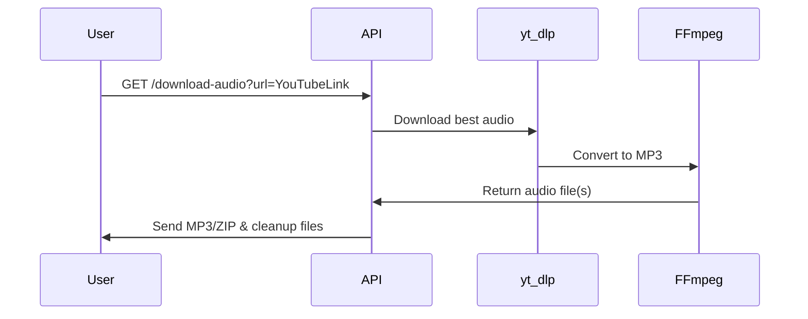

# 🎵 YouTube Audio Downloader API

A **FastAPI-based** service that downloads audio (MP3) from YouTube videos or playlists, packages them into a ZIP if needed, and returns them directly to the client. Includes automatic file cleanup and optional IP-based rate limiting. Designed for lightweight deployments, including Render.

---

## 🚀 Features
- **Video & Playlist Support** – Converts YouTube videos or playlists to MP3.
- **Automatic Cleanup** – Deletes files after sending to the client.
- **IP Rate Limiting** *(optional)* – Prevents abuse.
- **Async & Non-blocking** – Uses asyncio for smooth performance.
- **Render-ready** – Easy deployment to Render or other cloud platforms.

---

## 📦 Installation

### 1. Clone the repository
```bash
git clone https://github.com/yourusername/youtube-audio-api.git
cd youtube-audio-api
```

### 2. Install dependencies
```bash
pip install -r requirements.txt
```

### 3. Install FFmpeg
This service uses **FFmpeg** for audio extraction. On Fedora:
```bash
sudo dnf install ffmpeg
```
On Ubuntu/Debian:
```bash
sudo apt update && sudo apt install ffmpeg
```

### 4. Run locally
```bash
uvicorn main:app --reload
```
Server will start on:
```
http://127.0.0.1:8000
```

---

## 🔧 API Endpoints

### `GET /download-audio`
**Query Parameters:**
| Parameter | Type | Required | Description |
|-----------|------|----------|-------------|
| `url`     | string | Yes | YouTube video or playlist URL |

**Example Request:**
```bash
curl -X GET "http://127.0.0.1:8000/download-audio?url=https://www.youtube.com/watch?v=VIDEO_ID" -o audio.mp3
```

**Example Response:**
- If the URL is a **single video** → returns `.mp3` file.
- If the URL is a **playlist** → returns `.zip` containing all MP3s.

---

## 🔢 Environment Variables
| Variable | Description | Default |
|----------|-------------|---------|
| `PORT`   | Port to run the server on | `8000` |
| `RATE_LIMIT` | Requests allowed per minute per IP | `5/min` |

---

## 🛠 Deployment on Render

1. **Push your code to GitHub**.
2. **Create a new Web Service** on Render.
3. **Select your repository**.
4. **Set the Start Command**:
```bash
uvicorn main:app --host 0.0.0.0 --port $PORT
```
5. **Add FFmpeg build step** in `render.yaml` (optional).
6. Deploy and start using your API.

---

## 👀 Example Workflow


---

## 📝 License
MIT License. See `LICENSE` for details.

---

## 💡 Notes
- This API is intended for **personal and educational use only**.
- Respect YouTube's Terms of Service when using this API.
